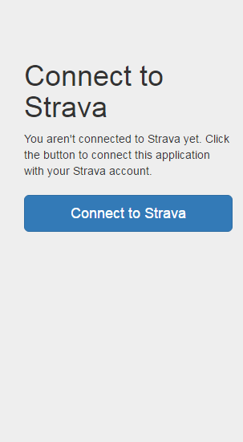

# Strava-sync

## Motivation

Decathlon coach is the web platform used by various Geonaute Decathlon devices. It hasn't integration with Strava platform neither public api. This application proposes a simple solution to solve the unidirectional synchronization between Decathlon Coach and Strava.

## Description

Strava-sync periodically synchronizes Decathlon Coach activities with Strava.

Decathlon Coach hasn't api (at the time of creation of this application). For this reason a web spider or crawler (Jsoup) is used to extract the information from the platform (web scrapping) and download the activities in gpx format. The activities upload to the Strava platform is realized through its api.

The login is made with Strava Oauth 2. Basic information of each user is saved with Decathlon Coach platform's credentials as well as activities that have been synchronized, to avoid unnecessary synchronizations. Activities upload duplicated isn't check, Strava already does it.

## Screenshots

 


## Technologies

- Java (1.8)
- Spring Boot
- Jsoup (crawler / web spider)
- Javastrava (Strava api library)
- Thymeleaf (template engine)
- Bootstrap

## Requirements

- Apache Maven 3
- JDK 1.8

## Code Formatter

The code formatter used for this project follows the Google style guide for Java (https://google.github.io/styleguide/javaguide.html).

The **intellij-java-google-style.xml** file located in the project root is an implementation of this guide.

## Local Deployment

### Database

A database in memory (H2) is used (it doesn't require installation).

### Strava application

You must create an application in Strava (each user account only allows the administration of one application).

Redirect domain authorized must be configured in the application. You can configure one application and update this domain depending on the environment or create two applications (recommended), each with its redirect domain configured for its own environment.

Redirect domain authorized for the local environment should be ```localhost```.

### Variables

The following local variables obtained from the application created in Strava must be configured in the application.properties file:

```
STRAVA_CLIENT_ID = {code strava client app}
STRAVA_CLIENT_SECRET = {code strava client secret app}
```

### Deployment

Application deployment in the local environment is made as a normal Spring Boot application.

## HEROKU deployment

### Database

Heroku provides a Postgre database by default. Although the application uses Hibernate to abstract the implementation of the database, it hasn't support for timestamp in Postgre. For this reason we will use a Mysql database.

To use a Mysql database you will need to uninstall the default Postgre plugin and install the Cleardb plugin (Mysql database).

### Strava application

Redirect domain authorized by the heroku environment should be ```{application name heroku}.herokuapp.com```.

### Variables

The following variables must be configured in the Heroku application:

```
DATABASE_URL = jdbc: mysql: // {host} .cleardb.com / heroku_ {code}? Reconnect = true
DATABASE_USERNAME = {code username cleardb}
DATABASE_PASSWORD = {code password cleardb}
STRAVA_CLIENT_ID = {code strava client app}
STRAVA_CLIENT_SECRET = {code strava client secret app}
ACTIVITIES_SYNC_TIME = 300
UPLOAD_ACTIVITIES = true
```

### Deployment

It will generate a .war of the application that later must be uploaded to heroku.

To generate the web packaging (.war) you must use the following maven command:
```
Mvn clean package
```

This command clears the working directory (/target), compiles the source code, launches the tests (unit and integration) and if it does not fail, it builds the file **strava-sync-web.war** and leave it in the folder **/target**

## Pending tasks

- Passwords are saved in plain text in database, should be saved encrypted.